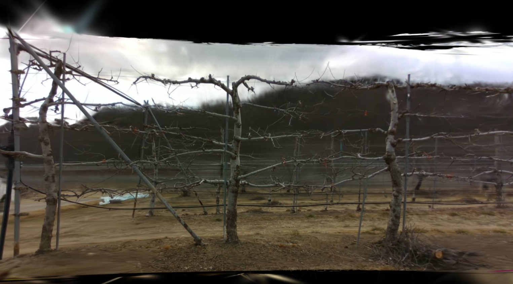
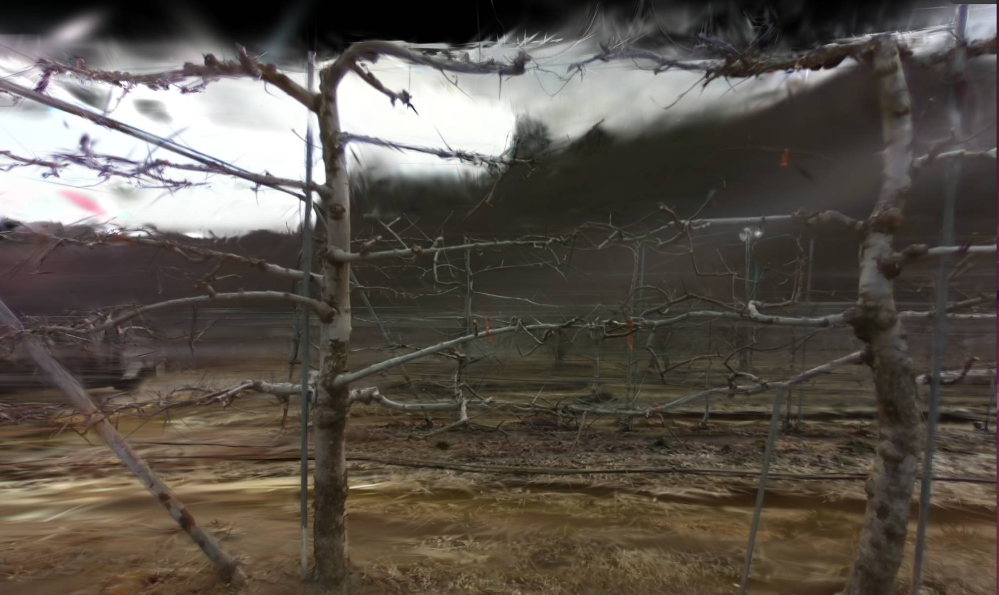

# slam_guided_gaussian_splatting

This project replaces the usual COLMAP-based camera pose estimation step in a Gaussian Splatting workflow with an ORB-SLAM2-based pipeline. It is intended for temporally continuous image sequences, including repetitive-feature environments such as orchards, where using frame order and temporal continuity can be useful. The SLAM stage is used offline and is configured for pose/export quality rather than real-time operation.

## Overview

Many Gaussian Splatting workflows expect a COLMAP-style dataset: selected input images, camera intrinsics, camera poses, and sparse 3D points under a `sparse/` directory. COLMAP estimates these with SfM, which is well suited to unordered image collections and sparse image sampling.

This repository instead runs a modified monocular ORB-SLAM2 executable on a sorted image sequence, then exports the resulting SLAM map and selected keyframes as a COLMAP text model. This keeps the downstream gsplat data interface close to the common COLMAP layout while replacing the pose source with SLAM.

The implementation does not try to process every frame as Gaussian Splatting training input. It samples keyframes from the sequential stream and exports those keyframes with their poses and observed map points.

## Features

- Docker-based CUDA 11.8 development environment.
- Pixi environments for ORB-SLAM2 (`orbslam2`) and gsplat (`gs`).
- Modified ORB-SLAM2 monocular executable that reads an image directory and exports a COLMAP-style text model.
- Keyframe-based image export for Gaussian Splatting input.
- Wrapper script for SLAM-to-gsplat input generation.
- Wrapper script for gsplat custom training and viewing.
- Example qualitative result screenshots in `images/`.

## Pipeline / Method

The intended flow is:

1. Build the project environment using docker.
2. Prepare a sequential image directory and camera YAML configuration at ./ORB_SLAM2/Examples/Monocular/example.yaml. 
3. Run the modified ORB-SLAM2 monocular executable through `scripts/images_to_gs_input.py`.
4. Export selected keyframes and SLAM poses to a COLMAP-style dataset.
5. Train gsplat with `scripts/gs_custom.py train`.
6. Open the latest training checkpoint with `scripts/gs_custom.py view`.

The SLAM export creates the dataset layout expected by the included gsplat COLMAP parser:

```text
<output-dir>/
  images/
    kf_000000_<source-name>.png
    ...
  sparse/
    0/
      cameras.txt
      images.txt
      points3D.txt
```

`KeyFrameTrajectory.txt` is also written by the ORB-SLAM2 executable in `ORB_SLAM2/`.

## Repository Structure

```text
.
├── Dockerfile
├── pixi.toml
├── scripts/
│   ├── images_to_gs_input.py
│   └── gs_custom.py
├── ORB_SLAM2/
│   ├── build.sh
│   ├── Examples/Monocular/example.yaml
│   ├── Examples/Monocular/mono.cc
│   ├── Vocabulary/ORBvoc.txt.tar.gz
│   ├── include/
│   └── src/
└── gsplat/
    ├── examples/custom_trainer.py
    ├── examples/simple_viewer.py
    └── examples/datasets/colmap.py
```

Important files:

- `Dockerfile`: builds an Ubuntu 22.04 CUDA 11.8 image, installs Pixi, installs both Pixi environments, and builds ORB-SLAM2.
- `pixi.toml`: defines the `orbslam2` and `gs` environments. It also contains hard-coded example tasks for one local dataset path.
- `scripts/images_to_gs_input.py`: wrapper around `ORB_SLAM2/Examples/Monocular/mono`. It changes into `ORB_SLAM2`, validates paths, then runs the executable through `pixi run -e orbslam2`.
- `scripts/gs_custom.py`: wrapper around `gsplat/examples/custom_trainer.py` and `gsplat/examples/simple_viewer.py`. It records the training data path in `gs_custom_run.json`, finds the latest rank-0 checkpoint for viewing, and sets `CUDA_VISIBLE_DEVICES`.
- `ORB_SLAM2/Examples/Monocular/example.yaml`: camera intrinsics, distortion, ORB extractor settings, and keyframe sampling parameters.
- `ORB_SLAM2/build.sh`: builds DBoW2, g2o, extracts `ORBvoc.txt`, and builds the ORB-SLAM2 executable.
- `ORB_SLAM2/src/System.cc`: contains the COLMAP text export implementation.
- `gsplat/examples/datasets/colmap.py`: loads the exported `sparse/0` or `sparse` COLMAP layout for training.

## Installation / Environment Setup

### Prerequisites

- Linux environment.
- NVIDIA GPU and NVIDIA Container Toolkit if using Docker with GPU access.

### Docker Setup

Build the image from the repository root:

```bash
docker build -t orb_slam2_gsplat .
```

Run the image with GPU access and mount a dataset directory(in this example : ~/share):

```bash
docker run \
    -dit \
    --net=host \
    -e DISPLAY=$DISPLAY \
    -e NVIDIA_DRIVER_CAPABILITIES=all \
    -e "TERM=xterm-256color" \
    -e "QT_X11_NO_MITSHM=1" \
    -v /tmp/.X11-unix:/tmp/.X11-unix:ro \
    -v ~/share:~/share \
    --user root \
    --security-opt seccomp=unconfined \
    --name orb_slam2_gsplat \
    --runtime=nvidia \
    --gpus all \
    --shm-size=8G \
    --ipc=host \
    --privileged \
    orb_slam2_gsplat  \
    /bin/bash
```

and builds ORB-SLAM2 during the image build.

## Usage

### 1. Prepare Input Images and Camera Configuration

Provide a directory of sequential images. The modified monocular executable scans the directory, keeps image files with common image extensions, sorts them by filename. 

Update the camera intrinsics and distortion values in:

```text
ORB_SLAM2/Examples/Monocular/example.yaml
```

The YAML file also controls `Input.MaxImages`. A value of `0` or a negative value processes all images.

### 2. Run ORB-SLAM2 and Export gsplat Input

Use absolute paths for dataset inputs and outputs, especially inside Docker:

```bash
python3 scripts/images_to_gs_input.py \
  --image-dir <image-dir> \
  --output-dir <output-dir>
```

This wrapper runs:

```text
pixi run -e orbslam2 ./Examples/Monocular/mono ./Vocabulary/ORBvoc.txt ./Examples/Monocular/example.yaml <image-dir> <output-dir>
```

Expected inputs:

- `--image-dir`: directory containing the ordered image sequence.
- `--config-path`: ORB-SLAM2 camera/settings YAML. Defaults to `./Examples/Monocular/example.yaml` after changing into `ORB_SLAM2`.
- `--vocab-path`: ORB vocabulary file. Defaults to `./Vocabulary/ORBvoc.txt`.
- `--mono-exe`: modified ORB-SLAM2 monocular executable. Defaults to `./Examples/Monocular/mono`.
- `--output-dir`: COLMAP-style output directory. Defaults to `./Results_GS_INPUT`.

Expected outputs:

- `<output-dir>/images/`: selected and optionally undistorted keyframe images.
- `<output-dir>/sparse/0/cameras.txt`: one OPENCV camera record.
- `<output-dir>/sparse/0/images.txt`: exported keyframe poses and 2D observations.
- `<output-dir>/sparse/0/points3D.txt`: observed SLAM map points and tracks.
- `ORB_SLAM2/KeyFrameTrajectory.txt`: ORB-SLAM2 keyframe trajectory in TUM-style format.

If the configured distortion coefficients are nonzero, exported keyframe images are undistorted before being written. The exported `cameras.txt` uses the OPENCV camera model with zero distortion coefficients for the saved images.

### 3. Train gsplat

Train using the exported COLMAP-style directory:

```bash
python3 scripts/gs_custom.py train \
  --data-dir <ORB_SLAM2's output-dir> \
  --result-dir <output-dir> \
  --gpu 0 \
  --port 8082
```

The wrapper runs `gsplat/examples/custom_trainer.py` inside the `gsplat/` directory with the `gs` Pixi environment. `--result-dir` is interpreted relative to `gsplat/` unless an absolute path is provided.

Training outputs are written under the result directory. The included trainer creates directories such as:

```text
gsplat/results/custom2/
  cfg.yml
  gs_custom_run.json
  ckpts/
  stats/
  renders/
  ply/
  tb/
```

`gs_custom_run.json` is written by the wrapper and stores the data directory used for training.

### 4. View the Latest Checkpoint

Open the latest rank-0 checkpoint in the result directory:

```bash
python3 scripts/gs_custom.py view \
  --result-dir <Train's output-dir> \
  --gpu 0 \
  --port 8082
```

If `--data-dir` is omitted, the wrapper reads it from `gs_custom_run.json` or `cfg.yml`. The viewer command uses `gsplat/examples/simple_viewer.py` with `--flip_yz` and serves on the selected port.

## Keyframe Sampling Strategy

The current monocular keyframe policy is implemented in `ORB_SLAM2/src/Tracking.cc` and configured by `ORB_SLAM2/Examples/Monocular/example.yaml`.

For normal monocular tracking, the code uses a fixed spacing candidate followed by a similarity check:

1. Wait until at least `Tracking.MinFrames` frames have passed since the last keyframe.
2. Compare the current frame against the last keyframe using the ratio of shared tracked map points.
3. Accept the frame as a new keyframe only when the similarity ratio is below `Tracking.RefRatioMonocular`.
4. Require at least `Tracking.MinInliersNewKF` tracking inliers.

The provided default configuration uses:

```yaml
Tracking.MinFrames: 10
Tracking.RefRatioMonocular: 0.75
Tracking.MinInliersNewKF: 12
```

This corresponds to interval-based sampling with rejection of frames that are still too similar to the previous keyframe.

## Results

The repository includes qualitative Gaussian Splatting render screenshots from an orchard-like scene.



*Qualitative render example from the repository's `images/screenshot1.png`.*



*Qualitative render example from the repository's `images/screenshot2.png`.*

## Outputs

The SLAM export produces a COLMAP-style text dataset that can be loaded by the included gsplat COLMAP parser:

- Camera intrinsics: `<output-dir>/sparse/0/cameras.txt`.
- Keyframe camera poses and 2D feature tracks: `<output-dir>/sparse/0/images.txt`.
- Sparse SLAM map points: `<output-dir>/sparse/0/points3D.txt`.
- Selected keyframe images: `<output-dir>/images/`.
- ORB-SLAM2 keyframe trajectory: `ORB_SLAM2/KeyFrameTrajectory.txt`.

The gsplat training wrapper writes outputs under `gsplat/<result-dir>` by default, including checkpoints in `ckpts/` and run metadata in `gs_custom_run.json`.

## Limitations / Notes

- The pipeline is offline and may be slower than a conventional real-time ORB-SLAM2 setup but it's faster than colmap.
- The output uses selected keyframes rather than every input frame.
- The monocular ORB-SLAM2 pipeline depends on camera calibration, image quality, scene texture, motion pattern, and successful tracking.
- Repetitive orchard-like environments motivate this design, but reconstruction quality can still vary by dataset.
- The default example paths in `pixi.toml` are hard-coded to `/root/share/kimm_bag/...`; adjust commands and paths for your data.
- The current repository provides a COLMAP-style text export, not a full COLMAP reconstruction workflow.

## License

This repository includes or depends on components under different licenses:

- `gsplat`: Apache License 2.0. See `gsplat/LICENSE`.
- `ORB-SLAM2`: GNU General Public License v3.0. See `ORB_SLAM2/License-gpl.txt`.

Users should review license compatibility, redistribution requirements, source disclosure obligations, and deployment constraints before redistributing this repository or derived work. This README is not legal advice.

## Acknowledgements

This project builds on:

- ORB-SLAM2
- gsplat
